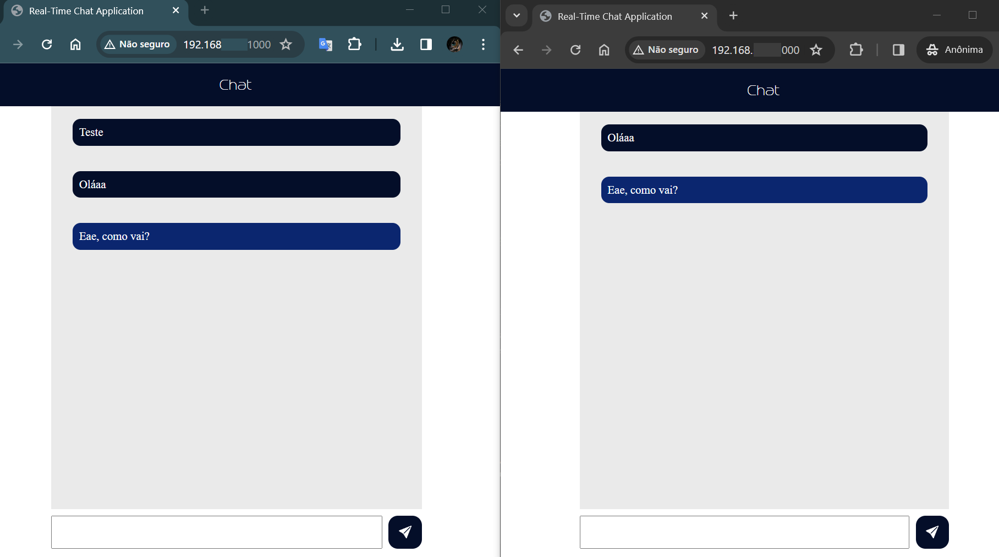

# Chat em tempo real
Sistema para bate-papo em tempo real utilizando servidor local, configurável no arquivo `server.js`. 
Deste modo, ao conectar pelo Id:porta, é possível fazer com que vários usuários se comuniquem de forma síncrona, conforme a imagem abaixo.

> [!NOTE]
> _Projeto desenvolvido durante o evento <b>Intensivão de JavaScript</b> da Hashtag Treinamentos._

----

## Real-time chat
System for real-time chat using local server, configurable in the file `server.js`. 
This way, when connecting via Id:port, it is possible to have several users communicate synchronously, as shown in the image below.

 > [!NOTE]
 > _Project developed during Hashtag Trainings' JavaScript Intensivão event._
 

